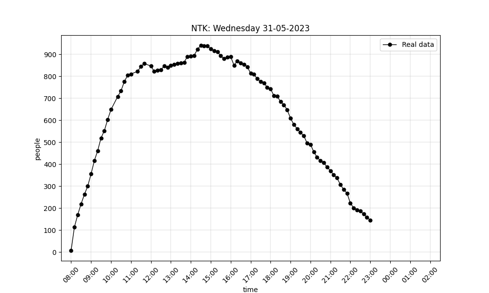
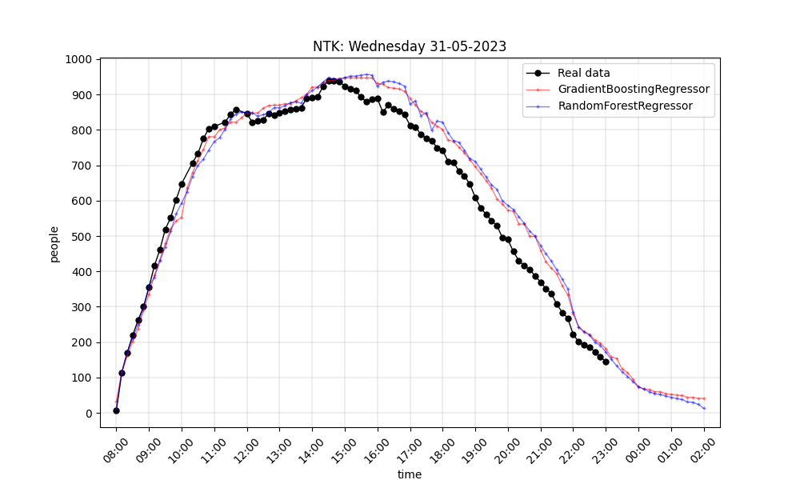
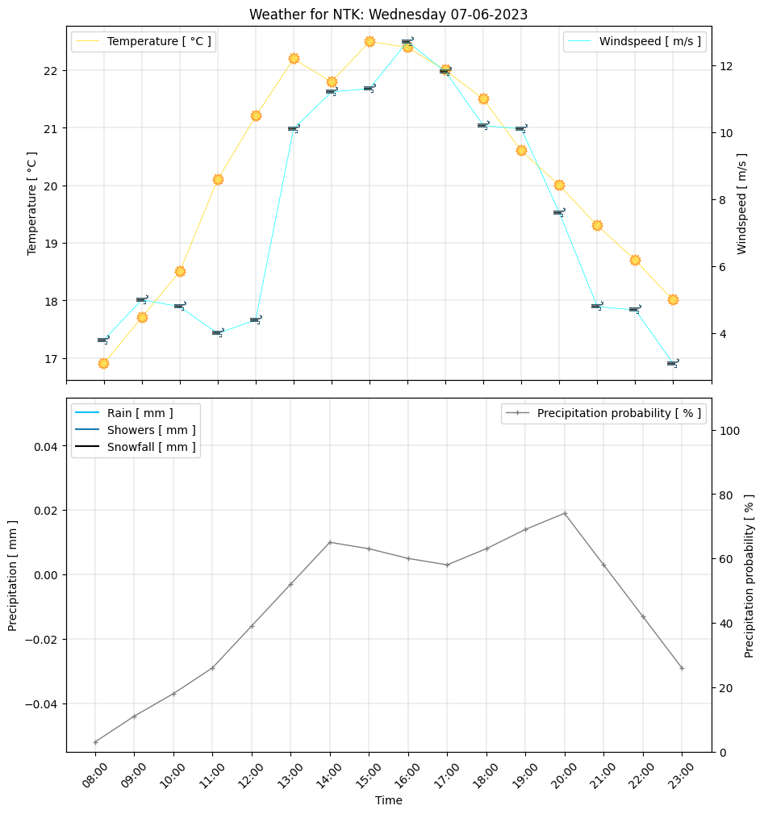

# NTK bot
Telegram bot in @chat_ntk chat for students who regularly visit the National Technical Library. The bot regularly collects statistics on library visits. Based on this data, simple machine learning models were created for regression of visits.


|  |  |
|:---:|:---:|
| Daily graph | Daily graph with predictions |

| |
|:---:|
| Weather forecast |


## Current and planned functions:
- [x] Shows the current number of people in the NTK
- [x] Regular storage of data from the library website on the number of people
- [x] Draws a diagram of people's visits in the NTK
- [x] Predicting the number of people in the library based on the received data with ML models
- [x] Weather forecasts
- [ ] Anti-bot filter
- [ ] Function for temporary self muta/ban from the chat so that students are not distracted from their studies

## Data sources:
- [NTK website](https://www.techlib.cz/)
- [Open-Meteo](https://open-meteo.com/)


## How prediction works:
The data of visits to the People's Technical Library is permanently stored. This data was processed and fed to models for training according to this principle:

| X1 | X2 | X3 | Y |
|:---:|:---:|:---:|:---:|
| time | day of the week | month | number of people |

`f(X1, X2, X3) = Y -> f(time, day of the week, month) = number of people`

Two models are used:
- Random Forest Regressor
- Gradient Boosting Regressor

## Installation and start

### Necessary:
Install requirements packages
```sh
> python3 -m venv venv
> pip install -r requirements.txt
```
Create `.env` file and write **api token**
```env
BOT_TOKEN=<TOKEN>
```

### Start:
From the root directory of the project
```sh
> python3 main.py
```

### Optional:
Additional adjustable values in `.env`
```env
DELTA_TIME=<int>
SUPER_ADMINS=<int,int,int,...>
```
* `DELTA_TIME` - The time interval with which the bot collects visit data from the site. The default value is `20`
* `SUPER_ADMINS` - List of super admins for admin commands 


## Commands:
Prefixes: `!/`
- `/ntk` - Show the current number of people in the library
- `/help` - Show help
- `/graph` - Draw and send a diagram of library visits
- `/learn` - Train (re-) regression ML models for predicting the number of people in the library
- `/weather` - Show weather forecast